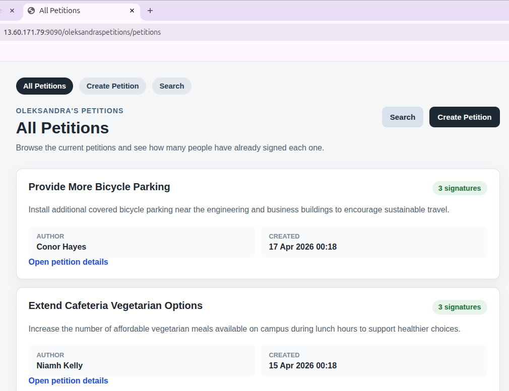
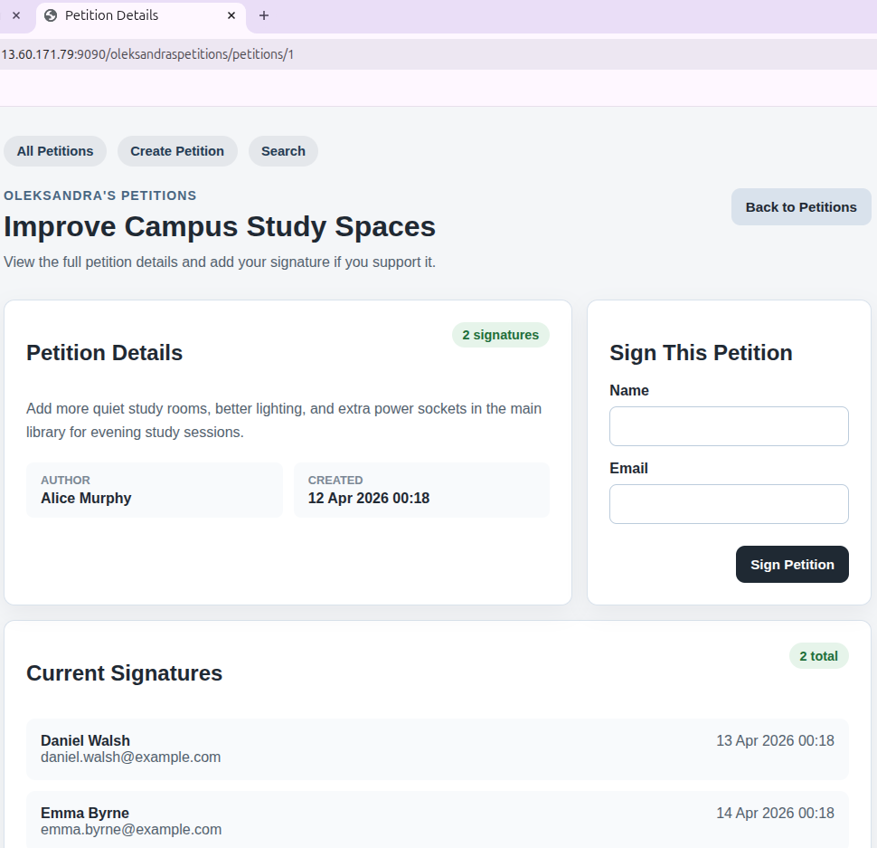
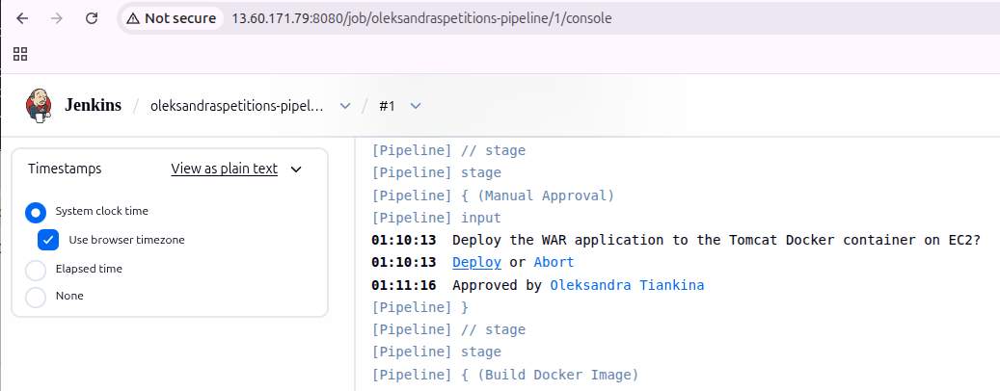
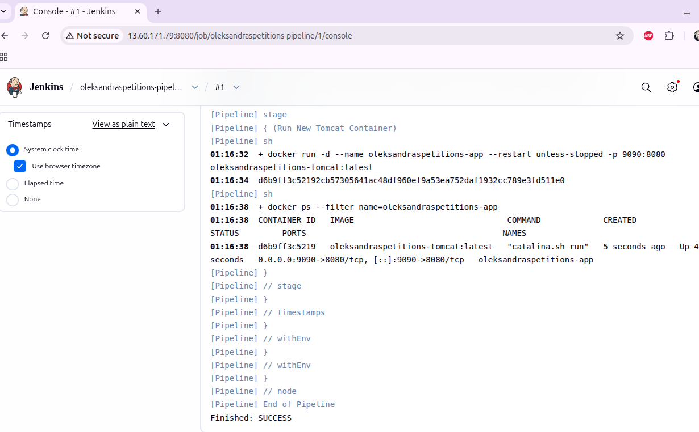

A simple Spring Boot petition platform built for a university DevOps assignment. The application allows users to create petitions, browse and search them, view petition details, and sign petitions. It is packaged as a WAR file and deployed through Jenkins as a Tomcat Docker container on AWS EC2.

- Live Application: http://13.60.171.79:9090/oleksandraspetitions

## Features

- Create a petition
- View all petitions
- Search petitions by keyword
- View search results
- View petition details
- Sign a petition
- Simple in-memory data storage for assignment/demo use

## Tech Stack

- Java 21
- Spring Boot
- Maven
- Thymeleaf
- Jenkins
- Docker
- Tomcat
- AWS EC2
- GitHub

## Architecture / Workflow

```text
Developer -> GitHub -> Jenkins -> Build / Test / Package -> Docker Image -> Tomcat Container on EC2
```

- Source code is pushed to GitHub.
- Jenkins pulls the repository and runs the pipeline defined in Jenkinsfile.
- Maven builds `target/oleksandraspetitions.war`.
- Docker packages the WAR into a Tomcat-based image using Dockerfile.
- Jenkins redeploys the Tomcat container on EC2.
- The application is exposed on port `9090`.

## Prerequisites

- Java 21
- Git
- Docker
- Jenkins
- Ubuntu EC2 VM for deployment

## Local Run

```bash
./mvnw test
./mvnw spring-boot:run
```

Open:

- `http://localhost:8080/`
- `http://localhost:8080/petitions`

## Build

```bash
./mvnw clean package
```

Generated artifact:

- `target/oleksandraspetitions.war`

## Docker Deployment Summary

The application is deployed as a Tomcat Docker container.

```bash
docker build -t oleksandraspetitions-tomcat:latest .
docker rm -f oleksandraspetitions-app || true
docker run -d --name oleksandraspetitions-app --restart unless-stopped -p 9090:8080 oleksandraspetitions-tomcat:latest
```

Application URL:

- `http://<EC2_PUBLIC_IP>:9090/oleksandraspetitions/`

## Jenkins Pipeline Summary

Pipeline stages:

- Checkout
- Build
- Test
- Package
- Archive WAR
- Manual approval
- Build Docker image
- Remove old container
- Run new Tomcat container

## AWS Deployment Summary

- Jenkins is installed directly on the Ubuntu EC2 host.
- Docker is installed on the same EC2 host.
- Jenkins uses host shell commands to build and redeploy the application container.
- The deployed application runs in a Tomcat container on port `9090`.

## Project Structure

```text
oleksandraspetitions/
├── Jenkinsfile
├── Dockerfile
├── pom.xml
├── src/
│   ├── main/
│   │   ├── java/com/oleksandra/oleksandraspetitions/
│   │   │   ├── controller/
│   │   │   ├── model/
│   │   │   ├── repository/
│   │   │   ├── service/
│   │   │   ├── OleksandraspetitionsApplication.java
│   │   │   └── ServletInitializer.java
│   │   └── resources/
│   │       ├── static/
│   │       └── templates/
│   └── test/
└── README.md
```

## Screenshots

### Home Page


### Petition Details


### Manual Deploy


### Jenkins Build


## Future Improvements

- Add persistent database storage
- Add user authentication and authorization
- Add pagination for large petition lists
- Improve validation and error handling
- Add more automated tests
- Add monitoring and logging for deployment
